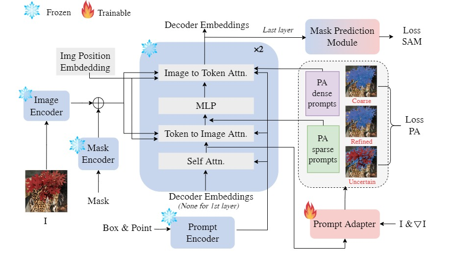
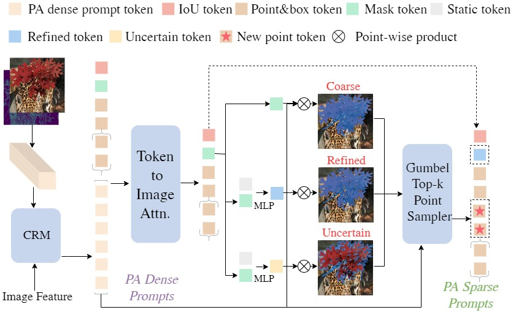

# PA-SAM: Prompt Adapter SAM for High-quality Image Segmentation

Official implementation of [&#39;PA-SAM: Prompt Adapter SAM for High-quality Image Segmentation&#39;](https://arxiv.org/abs/).

## Introduction

The Segment Anything Model (SAM) has exhibited outstanding performance in various image segmentation tasks. Despite being trained with over a billion masks, SAM faces challenges in mask prediction quality in numerous scenarios, especially in real-world contexts. In this paper, we introduce a novel prompt-driven adapter into SAM, namely Prompt Adapter Segment Anything Model (PA-SAM), aiming to enhance the segmentation mask quality of the original SAM. By exclusively training the prompt adapter, PA-SAM extracts detailed information from images and optimizes the mask decoder feature at both sparse and dense prompt levels, improving the segmentation performance of SAM to produce high-quality masks. Experimental results demonstrate that our PA-SAM outperforms other SAM-based methods in high-quality, zero-shot, and open-set segmentation.





## Setup and Installation

The code package can be cloned from the git repository using:

```bash
> git clone https://github.com/xzz2/pa-sam.git
```

### Anaconda Environment Setup

The conda environment for the code can be created using the `envname.yaml` file provided with the scripts.

```bash
> cd pa-sam
> conda env create --file envname.yml
> conda activate pasam
```

## Preparation

Please download dataset **HQSeg-44K** for high-quality segmentation from [hugging face link](https://huggingface.co/sam-hq-team/sam-hq-training/tree/main/data), and the pre-trained weights of SAM from [here](https://dl.fbaipublicfiles.com/segment_anything/sam_vit_l_0b3195.pth). Then, unzip the dataset file and organize them as

```
data
|____DIS5K
|____cascade_psp
| |____DUTS-TE
| |____DUTS-TR
| |____ecssd
| |____fss_all
| |____MSRA_10K
|____thin_object_detection
| |____COIFT
| |____HRSOD
| |____ThinObject5K
pretrained_checkpoint
|____sam_vit_l_0b3195.pth
|____sam_vit_l_maskdecoder.pth
```

## Getting Started

### Training

```
sh train.sh
```

or

```
python -m torch.distributed.launch --nproc_per_node=<num_gpus> train.py --checkpoint <path/to/checkpoint> --model-type <model_type> --output <path/to/output>
```

Example PA-SAM-L training script

```
python -m torch.distributed.launch --nproc_per_node=8 train.py --checkpoint ./pretrained_checkpoint/sam_vit_l_0b3195.pth --model-type vit_l --output work_dirs/pa_sam_l
```

### Evaluation

```
sh eval.sh
```

or

```
python -m torch.distributed.launch --nproc_per_node=<num_gpus> train.py --checkpoint <path/to/checkpoint> --model-type <model_type> --output <path/to/output> --eval --restore-model <path/to/training_checkpoint>
```

Example PA-SAM-L evaluation script, and you can download the checkpoint from [here](https://pan.baidu.com/s/1PGfooGqweEPeXWvA5c55EA?pwd=wr97)

```
python -m torch.distributed.launch --nproc_per_node=1 train.py --checkpoint ./pretrained_checkpoint/sam_vit_l_0b3195.pth --model-type vit_l --output work_dirs/pa_sam_l --eval --restore-model work_dirs/pa_sam_l/epoch_20.pth
```

## TODO

- [ ] Combine pre-trained models to generate more detailed intermediate segmentation masks.
- [ ] Correction training for noisy prompts.

## Citation

```
@article{xie2024pasam,
  title={PA-SAM: Prompt Adapter SAM for High-quality Image Segmentation},
  author={Xie, Zhaozhi and Guan, Bochen and Jiang, Weihao and Yi, Muyang and Ding, Yue and Lu, Hongtao and Zhang, Lei},
  journal={arXiv preprint arXiv:},
  year={2024}
}
```

## Acknowledgement

This repo benefits from [Segment Anything in High Quality](https://github.com/SysCV/sam-hq). Thanks for their wonderful works.
